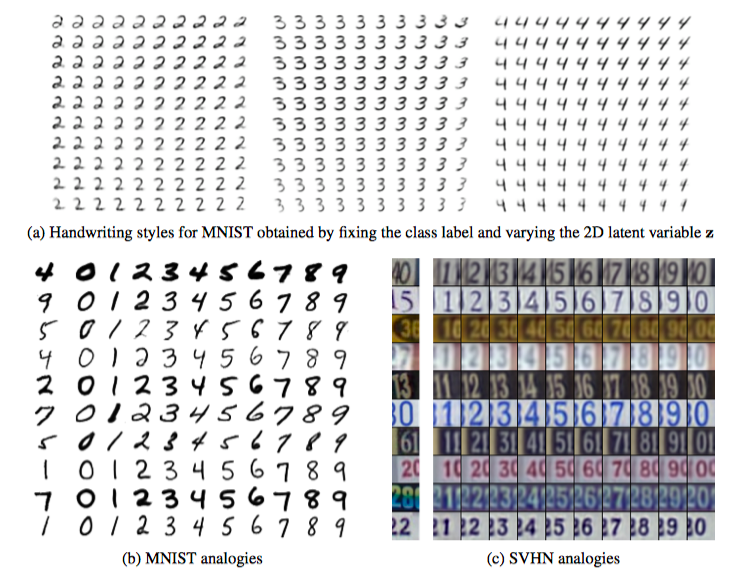

* Semi-supervised Learning with Deep Generative Models
* Diederik P.Kingma, Max Welling

# Summary

We assume $p_\theta(x|y, z), p_\theta(z), p_\theta(y), q_\phi(z|y, x), q_\phi(z, y|x)$. For labaled dataset,
$$
\log p_\theta(x) \ge \mathbb E_{q_\phi(z|y,x)} [\log \frac{p_\theta(x, y, z)}{q_\phi(z|y, x)}] = \mathbb E_{q_\phi(z|y, x)}[\log\frac{p_\theta (x|y, z)p_\theta(y)p_\theta(z)}{q_\phi(z|y, x)}] = -L(x, y)
$$
For unlabeled dataset
$$
\log p_\theta(x, y) \ge \mathbb E_{q_\phi(z, y|x)} [\log \frac{p_\theta(x, y, z)}{q_\phi(z, y| x)}] = \mathbb E_{q_\phi(z , y| x)}[\log\frac{p_\theta (x|y, z)p_\theta(y)p_\theta(z)}{q_\phi(z|y, x)q_\phi(y|x)}] = \sum_yq_\phi(y|x)(-L(x, y)) + \mathcal H(q_\phi(y|x)) = -U(x)
$$
The reason we need to separate out $\mathbb E_{q_\phi(y|x)}$ is that the sampling operation is not differentiable.

Finally, the loss is
$$
\mathbb E_{D_U}[U(x)] + \mathbb E_{D_L}[L(x, y)] + \alpha  \mathbb E_{D_L}[\log q_\phi(y|x)]
$$

# Introduction

Traditional ways of self-supervised learning:

* Simplest: self-training, using predicted results as labels
* TSVM: make unlabeled data far from the margins
* Graph-based methods

This work. Models the problem with a generative model (including class labels). Naturally, variational inference is introduced.

# Deep Generative Models for Semi-supervised Learning

The paper discussed two models for semi-supervised training, and how they can be combined to produce a uniform model.

**Latent-feature discrimnative model (M1)**: the idea is simple. Use VAE to learn representations, and use any other classifier for discrimantive learning. In particular, we model
$$
p(z)\sim \mathcal N(z|0, I)\\
p_\theta(x|z) \sim f(x|z;\theta)
$$
where $f(x|z;\theta)$ represent likelihood function. The parameters are computed using a neural network.

**Generative semi-supervised model (M2):** in this case, a latent class variable $y$ is introduce. The model is defined as
$$
p(y) = Cat(y|\pi);\quad p(z) = \mathcal N(z|0, I);\quad p_\theta(x|y, z) = f(x; y;\theta)
$$
We assume that $y$ and $z$ are marginally independent. 

**Stack generative semi-supervised model (M1 + M2)**: just use $z$ in M1 as $x$ in M2. This produces a model $p_\theta(x, y, z_1, z_2) = p(y)p(z_2)p_\theta(z_1|y, z_2)p_\theta(x|z_1)$. 

It seems that these two models are trained in two different phases in this work.

# Objective

First, we should clarify the approximate posteriors used here. For M1, this is
$$
\mathrm{Ml} : q_{\phi}(\mathbf{z} | \mathbf{x})=\mathcal{N}\left(\mathbf{z} | \boldsymbol{\mu}_{\phi}(\mathbf{x}), \operatorname{diag}\left(\boldsymbol{\sigma}_{\phi}^{2}(\mathbf{x})\right)\right)
$$
For M2 it is $q_\phi(z,y| x)$. It is useful to split this into $q_\phi(z|y, x)$ and $q_\phi(y|x)$ though:
$$
q_{\phi}(\mathbf{z} | y, \mathbf{x})=\mathcal{N}\left(\mathbf{z} | \boldsymbol{\mu}_{\phi}(y, \mathbf{x}), \operatorname{diag}\left(\boldsymbol{\sigma}_{\phi}^{2}(\mathbf{x})\right)\right) ; \quad q_{\phi}(y | \mathbf{x})=\operatorname{Cat}\left(y | \boldsymbol{\pi}_{\phi}(\mathbf{x})\right)
$$
For M1, this is just the VAE bound:
$$
\log p_\theta(x) \ge E_{q_\phi(z|x)}[\log p_\theta(x|z)] - KL[q_\phi(z|x) \|p_\theta(z)] = -\cal J(x)
$$
For M2, our general goal is maximum likelihood estimation. For labeled dataset, our goal is to maximize $\log p_\theta(x, y)$. This is
$$
\log p_{\theta}(\mathbf{x}, y) \geq \mathbb{E}_{q_{\phi}(\mathbf{z} | \mathbf{x}, y)}\left[\log p_{\theta}(\mathbf{x} | y, \mathbf{z})+\log p_{\theta}(y)+\log p(\mathbf{z})-\log q_{\phi}(\mathbf{z} | \mathbf{x}, y)\right]=-\mathcal{L}(\mathbf{x}, y)
$$
Intuitively, this learning two things: 

* Given $z, y$, how do we construct $x$? 
* Given $x, y$, what is $z$?

For unlabelled data, we want to maximize $p_\theta(x)$. That is
$$
\begin{aligned} \log p_{\theta}(\mathbf{x}) & \geq \mathbb{E}_{q_{\phi}(y, \mathbf{z} | \mathbf{x})}\left[\log p_{\theta}(\mathbf{x} | y, \mathbf{z})+\log p_{\theta}(y)+\log p(\mathbf{z})-\log q_{\phi}(y, \mathbf{z} | \mathbf{x})\right] \\ &=\sum_{y} q_{\phi}(y | \mathbf{x})(-\mathcal{L}(\mathbf{x}, y))+\mathcal{H}\left(q_{\phi}(y | \mathbf{x})\right)=-\mathcal{U}(\mathbf{x}) \end{aligned}
$$
Intuitively, given $x$, we are

* Guess a $y$, use this to learn things about $z$, as in the first part
* Learn $\phi$ that maximizes the reconstruction probability. At the same time, the entropy should be large.

Then our objective is that
$$
\mathcal J = E_{D_L}[-\mathcal L(x, y)] + E_{D_U}[-\mathcal U(x)]
$$
One thing that we note that, the model is only learning $q_\phi(y|x)$ on unlabeled dataset, which is an undersirable property. Ideally, all model and variational parameters should learn in all cases. To remedy this, a classfication loss is added:
$$
\mathcal J^\alpha = \mathcal J + \alpha E_{D_L}[-\log q_\phi(y|x)]
$$
In practive, $\alpha$ is set to 0.1.

Note that optimizing this **expectations** will results in the **optimal** parameters. But estimating different terms will results in different variances, that's why we will want to weight these different terms.

# Computational Complexity

Unfortunately, this scales with the class number.

# Experimental Results

* Train on MNIST with few labels. It works the best
* Conditional generation: set $y$ (digit) or $z$ (style) fixed. This generates very good results:

