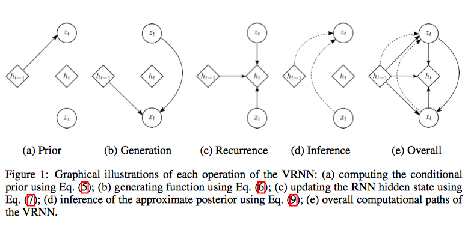

Are we making the assumption that, given $x_{\le T}$, $z_{\le T}$ and $x_{> T}$ are conditionally independent? Without this assumption, equation (10) in the paper should have been
$$
q(z_{\le T}|x_{\le T})  = \prod_{t =1}^T q(z_t |x_{\le T}, z_{<t})
$$
instead of
$$
q(z_{\le T}|x_{\le T})  = \prod_{t =1}^T q(z_t |x_{\le t}, z_{<t})
$$
And the objective in equation (11) wouldn't hold as well.

* A Recurrent Latent Variable Model for Sequential Data
* Junyoung Chung, Yoshua Bengio

# Motivation

Traditional RNNs models $p(x_t|x_{< t})$ directly. This limits the form $p(x_t |x_{< t})$ can take. However, in practice, $p(x_t |x_{< t})$ maybe extremely multi-model and exhibit extreme variability. In this case, directly modeling $p(x_t|x_{<t})$ is insufficient.

## Sequence modeling with RNN

RNN models the joint distribution $x = (x_1, x_2, \ldots, x_T)$ be modeling $p(x_t|x_{<t})$ recursively. A hidden state $h_t$ is used to remember $x_1, \ldots, x_t$, and this is recursively defined as
$$
h_t = f_\theta(x_t, h_{t-1})
$$
Given this, we can define the conditional distribution $p(x_t|x_{<t})$ as
$$
p(x_t|x_{<t}) = g_\tau (x_t, h_{t-1})
$$
since $h_{t-1}$ is a deterministic function of $x_{t-1}$, this makes sense.

The main representational power of an RNN comes from $g_\tau$. This determines how complex the distribution can be. Typically, $g_\tau$ is defined in terms of a function that gives the parameter of a parametric distribution, like a mixture of gaussian, or multinomial distribution.

However, since we can only use a relatively simple $g_\tau$, the model's modeling ability is significantly limited. When modelling sequences that are highly variable and highly structured, this is inadequate.

# Variational Recurrent Neural Network

**Preview**. Instead of modelling $p(x_{\le t})$, we will introduce a number of latent variables $p(z_{\le t})$. And we assume the process of generating $x_t$ given $z_{< t}$ and $x_{< t}$:

1. $z_t$ is drawn from $p(z_t|x_{<t}, z_{<t})$
2. $x_t$ is drawn from $p(x_t|z_{\le t}, x_{<t})$

This is a typical VAE formulation. With this formulation, $p(x_t|x_{<t}, z_{<t})$ can be highly complex yet structured.

**Generation** The VRNN contains a VAE at every timestep. However, these VAEs are conditioned on the state variable $h_{t-1}$ of an RNN. To define $p(x_t, z_t|x_{<t}, z_{<t})$, we will first define $h_{t-1}$ to be deterministic function of $x_{<t}, z_{<t}$ as
$$
h_t = f_\theta(\varphi^x_\tau (x), \varphi^x_\tau(z), h_{t-1})
$$
Given this, we define
$$
z_t \sim \mathcal N(\mu_{z, t}, diag(\sigma^2_{z, t}))\quad [\mu_{z, t}, \sigma_{z, t}] = \varphi^{prior}_\tau (h_{t-1})
$$
and
$$
x_t|z_t \sim\mathcal N(\mu_{x, t}, diag(\sigma^2_{x, t}))\quad [\mu_{x,t}, \sigma_{x,t }] = \varphi^{dec}_\tau(\varphi^z_\tau(z), h_{t-1})
$$
Note the above two distributions are actually condition on $x_{<t}, z_{<t}$.

Given these, the join distribution $p(x_{\le T}, z_{\le T})$ is then given be
$$
p(x_{\le T}, z_{\le T}) = \prod _{t=1}^Tp(x_t|z_{\le t}, x_{< t})p(z_t|z_{< t}, x_{<t})
$$
**Inference**. Given $x_{< t}, z_{< t}$, we try to approximate $z_t$ given $x_t$, namely $q(z_{t}| x_{\le t}, z_{<t})$. We then define
$$
z_t|x_t \sim \mathcal N(\mu_{z, t}, diag(\sigma^2_{z, t}))\quad [\mu_{z, t}, \sigma_{z, t}] = \varphi^{dec}_{\tau}(\varphi^x_\tau(x), h_{t-1})
$$
Given this, the approximate posterior over the whole sequence is then
$$
q(z_{\le T}|x_{\le T})  = \prod_{t =1}^T q(z_t |x_{\le T}, z_{<t})
$$
It seems that we are assuming $z_t$ and $x_{>t}$ are conditionally independent given $x_{\le T}, z_{<t}$. So this is
$$
q(z_{\le T}|x_{\le T})  = \prod_{t =1}^T q(z_t |x_{\le t}, z_{<t})
$$
**Learning**. The training objective is given by
$$
\mathbb E_{q(z_{\le T}|x_{\le T})}[\log \frac{p(z_{\le T}, x_{\le T})}{q(z_{\le T}|x_{\le T})}]
$$
With the above three equations, and the assumption that $z_{\le T}$ and $x_{> T}$ and conditionally independent given $x_{\le T}$, we can derive the following objective:
$$
\mathbb{E}_{q(\mathbf{z} \leq T | \mathbf{x} \leq T)}\left[\sum_{t=1}^{T}\left(-\mathrm{KL}\left(q\left(\mathbf{z}_{t} | \mathbf{x}_{ \leq t}, \mathbf{z}_{<t}\right) \| p\left(\mathbf{z}_{t} | \mathbf{x}_{<t}, \mathbf{z}_{<t}\right)\right)+\log p\left(\mathbf{x}_{t} | \mathbf{z}_{ \leq t}, \mathbf{x}_{<t}\right)\right)\right]
$$
This is a good graph

